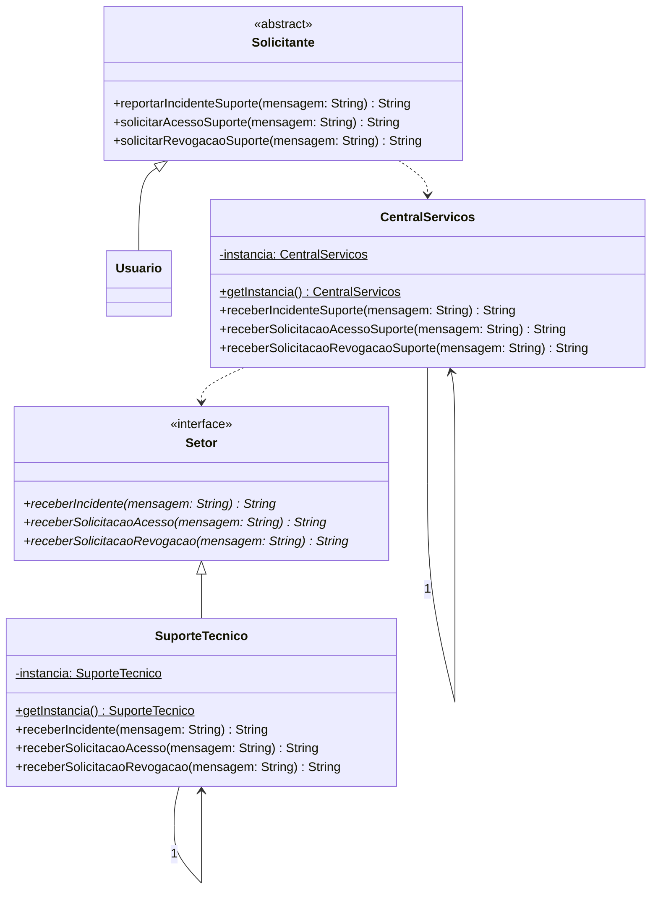

# Diagrama UML — Mediator (Central de Serviços de TI)

```mermaid
classDiagram
    class Solicitante {
        <<abstract>>
        +reportarIncidenteSuporte(mensagem: String) String
        +solicitarAcessoSuporte(mensagem: String) String
        +solicitarRevogacaoSuporte(mensagem: String) String
    }

    class Usuario

    class CentralServicos {
        -instancia: CentralServicos$
        +getInstancia() CentralServicos$
        +receberIncidenteSuporte(mensagem: String) String
        +receberSolicitacaoAcessoSuporte(mensagem: String) String
        +receberSolicitacaoRevogacaoSuporte(mensagem: String) String
    }

    class Setor {
        <<interface>>
        +receberIncidente(mensagem: String)* String
        +receberSolicitacaoAcesso(mensagem: String)* String
        +receberSolicitacaoRevogacao(mensagem: String)* String
    }

    class SuporteTecnico {
        -instancia: SuporteTecnico$
        +getInstancia() SuporteTecnico$
        +receberIncidente(mensagem: String) String
        +receberSolicitacaoAcesso(mensagem: String) String
        +receberSolicitacaoRevogacao(mensagem: String) String
    }

    Solicitante <|-- Usuario
    Setor <|-- SuporteTecnico

    Solicitante ..> CentralServicos
    CentralServicos ..> Setor

    CentralServicos --> CentralServicos : 1
    SuporteTecnico --> SuporteTecnico : 1
```
